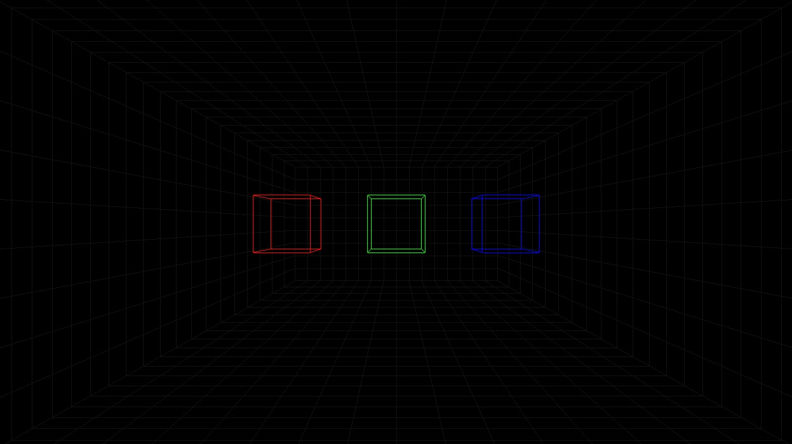

# wire-frame

A minimalist C++ engine.



## Quickstart

### Disclaimer

As the project has been written using [CLion](https://www.jetbrains.com/clion/), this guide only
describes the steps to have the project up and running with this editor.

This guide also assumes that you already have a working environment to work with c++
(you can compile simple projects).

### Installation

First, you will need to configure the toolchain.

This project uses `vcpkg` to manage its dependencies. Configure vcpkg using the following command:

```bash
# on Unix plateforms, using bash
./scripts/install.sh

# on Windows, using cmd
.\scripts\install.bat
```

> You may have to run the script several times. You will know that the installation is completed
> once you see that SFML has been installed in the logs.

Then, configure you cmake toolchain :

Go to `File` > `Settings` > `Build, Execution, Deployment` > `CMake` and add the following
under `CMake options` :

```
-DCMAKE_TOOLCHAIN_FILE=.vcpkg/scripts/buildsystems/vcpkg.cmake
```

Once this is done, run `File` > `Reload CMake Project` and it should correctly load the project.

You can now run the project.

Press `Shift + F10` to build and run the program. A window with a scene will open before you.

Enjoy !
